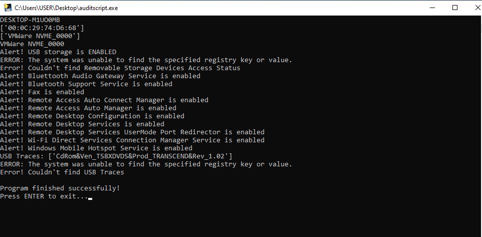
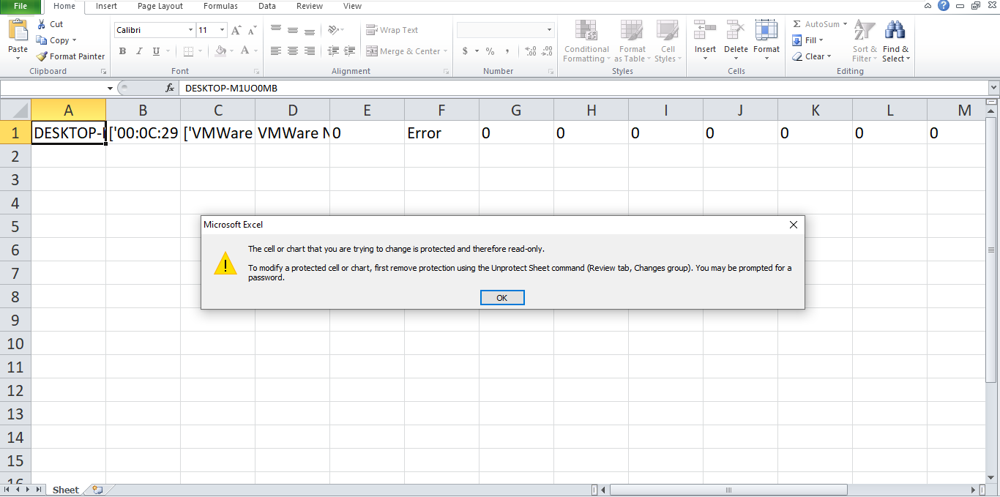
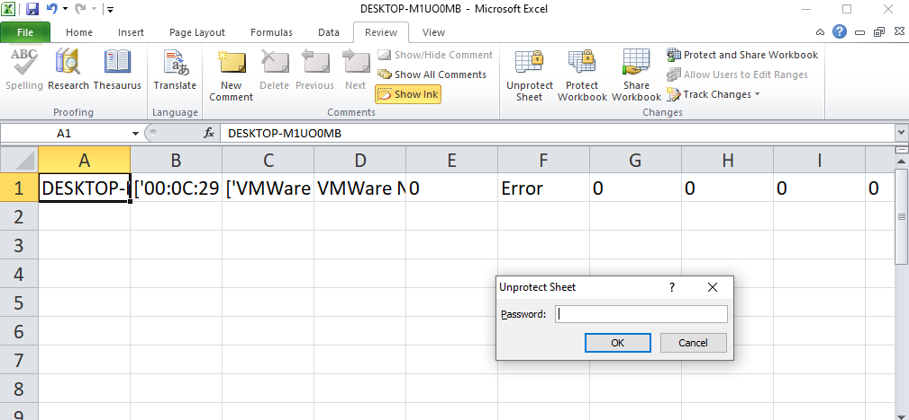

# USB & Endpoint Enumeration Tool

[Python script](auditscript.py) developed to enumerate Windows endpoints and collect basic security-related information.

## Features

- Hostname enumeration
- MAC address extraction
- Hard disk serial number collection
- USB storage history extraction from registry
- USB block policy detection
- Removable disk READ/WRITE/EXECUTE policy checks
- Basic Windows service status checks
  
- Export results to password-protected Excel file
  
  

## Output

The [script](auditscript.py) stores collected information in Excel format for auditing and analysis.

## Disclaimer

This project is intended for educational and authorized administrative/security auditing purposes only.
`Password` is mentioned in script.
